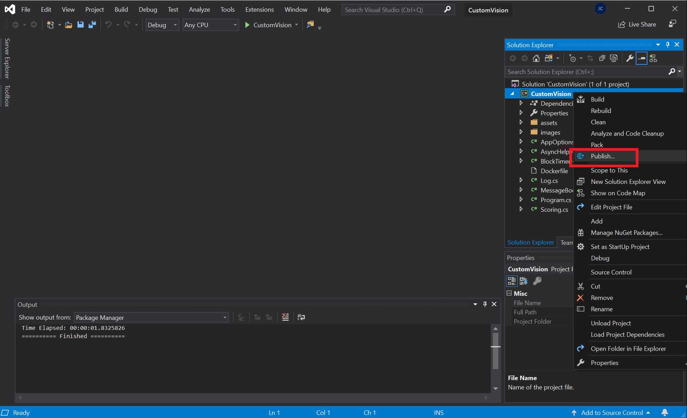
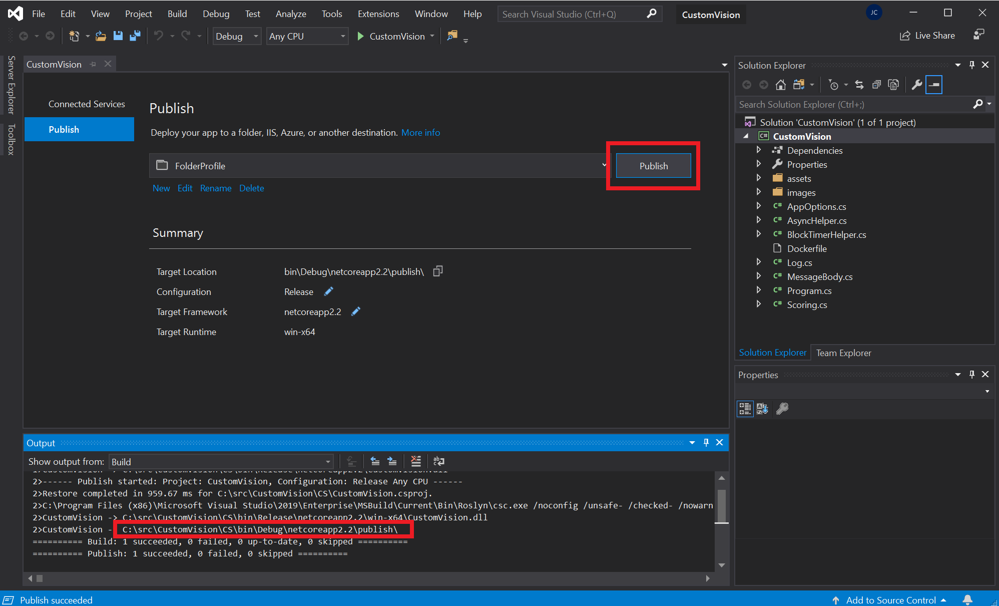

# Custom Vision using Windows ML container

This sample is a very basic use case of the Windows ML container to inference a model trained 
by [Azure Cognitive Services](https://azure.microsoft.com/en-us/services/cognitive-services/) - 
[Custom Vision](https://customvision.ai) for image classification. 

Included in the sample is a pre-trained model, and pre-selected example images, so you can see them in action. 
In your own application, you would train your own model, and supply your own images.

## Windows ML container

The Windows ML container is a container base image optimized for Intelligent Edge workloads on Windows, leveraging the Windows AI platform. 

## Prerequisites
Refer to the [Windows ML container Getting Started guide](https://docs.microsoft.com/windows/ai/windows-ml-container) for instruction to setting up development and test environments.

## Step 1 - Build and publish the C\# .NET application

Open ```CustomVision.sln``` using Visual Studio 2019

Right click on the CustomVision project and select "Publish"


You should see Visual Studio Publish tab.
You may need to select "Publish" second time depending on the state of the solution/project to ensure
you are publishing using "FolderProfile".
Visual Studio should then build the project and publishes to the specified output folder as a 
self-contained executable.



## Step 2 - Test the application 

Run the application, passing in the pre-packaged ONNX model file, and the location of test images--in this case, the ```images``` directory

If the model is successful, you will see a prediction label show in the console, one for each file in the ```images``` directory

```powershell
C:\src\CustomVision\CS\bin\Debug\netcoreapp2.2\publish>CustomVision.exe -m CustomVision.onnx -i images
8/3/2019 1:31:32 PM: Loading modelfile 'CustomVision.onnx' on the CPU...
8/3/2019 1:31:33 PM: ...OK 532 ticks
8/3/2019 1:31:33 PM: Running the model...
8/3/2019 1:31:33 PM: ...OK 47 ticks
8/3/2019 1:31:33 PM: Recognized {"results":[{"label":"White Panda","confidence":1.0}],"metrics":{"evaltimeinms":47,"cycletimeinms":0}}

C:\src\CustomVision\CS\bin\Debug\netcoreapp2.2\publish>
```

## Step 3 - Build a container

We will build a container with this model, based upon the Windows ML container

```powershell
C:\src\CustomVision\CS\bin\Debug\netcoreapp2.2\publish>docker build -t customvision:latest .
```

You will see the docker container built:

```
Sending build context to Docker daemon  86.69MB
Step 1/5 : FROM windowsml:latest
 ---> 9fa8731edc1b
Step 2/5 : ARG EXE_DIR=.
 ---> Running in 81ab18cbce4d
Removing intermediate container 81ab18cbce4d
 ---> 3fbbb830648d
Step 3/5 : WORKDIR /app
 ---> Running in 1dc7d9612a2e
Removing intermediate container 1dc7d9612a2e
 ---> 121e449e4d3a
Step 4/5 : COPY $EXE_DIR/ ./
 ---> 6f64b222b523
Step 5/5 : CMD [ "CustomVision.exe", "-mCustomVision.onnx", "-iimages", "-v" ]
 ---> Running in 1be3deb0a361
Removing intermediate container 1be3deb0a361
 ---> e2fd3f6486e7
Successfully built e2fd3f6486e7
Successfully tagged customvision:latest

C:\src\CustomVision\CS\bin\Debug\netcoreapp2.2\publish>docker images
REPOSITORY          TAG                 IMAGE ID            CREATED             SIZE
customvision        latest              e2fd3f6486e7        6 seconds ago       406MB
winmlrunner         latest              ed74203b2655        8 hours ago         325MB
windowsml           latest              9fa8731edc1b        9 hours ago         319MB
```

## Step 4 - Run the container

```powershell
C:\src\CustomVision\CS\bin\Debug\netcoreapp2.2\publish>docker run --isolation process customvision:latest
8/3/2019 1:35:03 PM: Loading modelfile 'CustomVision.onnx' on the CPU...
8/3/2019 1:35:03 PM: Model path: C:\app\CustomVision.onnx
Warning: ImageScaler was a removed  experimental ops. In the future, we may directly reject this operator. Please update your model as soon as possible.Warning: ImageScaler was a removed  experimental ops. In the future, we may directly reject this operator. Please update your model as soon as possible.8/3/2019 1:35:03 PM: ...OK 203 ticks
8/3/2019 1:35:03 PM: Opening C:\app\images\WhitePanda01.jpg...
8/3/2019 1:35:03 PM: Line 90 in C:\src\CustomVision\CS\Program.cs
8/3/2019 1:35:03 PM: Running the model...
8/3/2019 1:35:03 PM: ...OK 47 ticks
8/3/2019 1:35:03 PM: Recognized {"results":[{"label":"White Panda","confidence":1.0}],"metrics":{"evaltimeinms":47,"cycletimeinms":0}}
```

## What can you do with this now?

We're making this available for you at this early stage if you would like to test your models and scenarios against the Windows ML container. Feel free to modify the code here to use models and inputs of your choosing, and let us know how it goes!

If you wish the container had additional functionality, or are finding it difficult to use in some way, let us know at winmlcfb@microsoft.com. We want to hear your feedback!

## Try your own model!

In this sample, we've shown how to do object detection using a pre-cooked Custom Vision model. 
You can do the same thing with any AI model which can be converted to ONNX.

Read more to learn how!
* [ONNX and Azure Machine Learning: Create and deploy interoperable AI models](https://docs.microsoft.com/en-us/azure/machine-learning/service/how-to-build-deploy-onnx)
* [Convert ML models to ONNX with WinMLTools](https://docs.microsoft.com/en-us/windows/ai/convert-model-winmltools)
* [Tutorial: Use an ONNX model from Custom Vision with Windows ML (preview)](https://docs.microsoft.com/en-us/azure/cognitive-services/custom-vision-service/custom-vision-onnx-windows-ml)

Once you have an ONNX model, you'll need to make some changes to the sample.

Follow the instructions on [MLGen](https://docs.microsoft.com/en-us/windows/ai/mlgen) website to create interface files that can be used by your project.

Depending on the outputs of your model, make the necessary changes to the ResultsToMessage method in Program.cs. Here, you translate the output of your model into a JSON object suitable for transmission via Azure IoT Edge.
